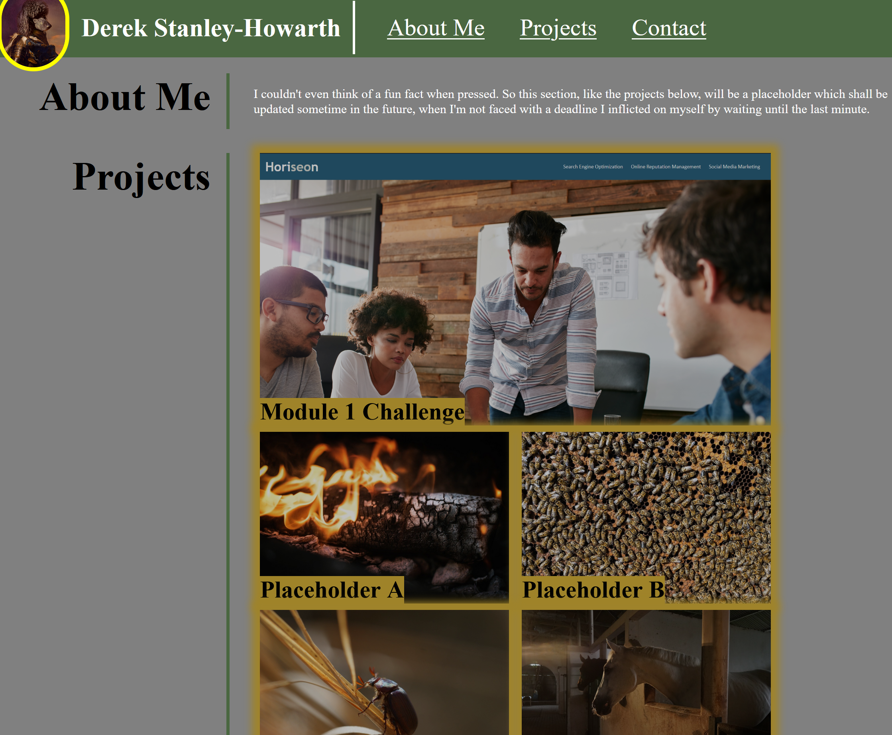

# Portfolio

## Description
A site with links to projects I have created over the course of a UCB bootcamp. As this was initially created during the second week, links will be updated to reflect the portfolio as it grows. 

## Usage
Visit https://dshowarth.github.io/Portfolio/ to view the site. 

## Credits

Images:
timmossholder via https://pixabay.com/photos/fire-log-hot-burn-burning-on-fire-8032745/ \
masbebet via https://pixabay.com/photos/horses-farm-whitehorse-animal-8026521/ \
xiSerge via https://pixabay.com/photos/european-honey-bees-bees-insects-8072075/ \
teddybeetle via https://pixabay.com/photos/beetle-insect-carapace-leaves-8070966/